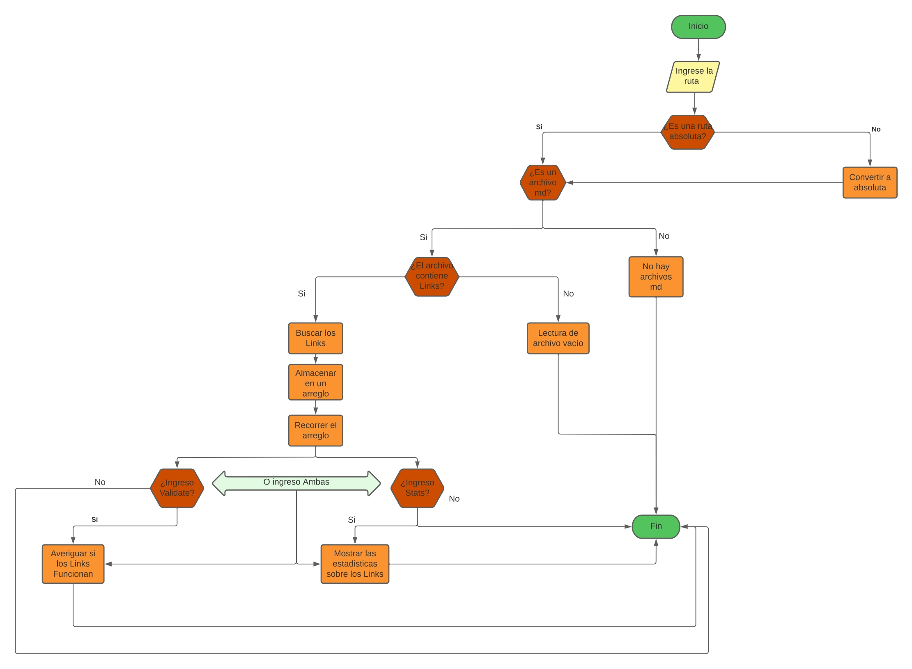
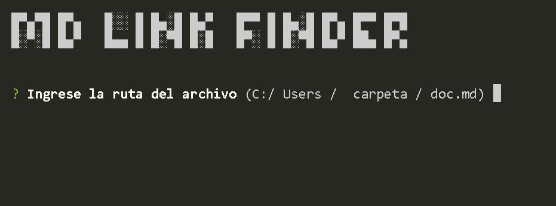
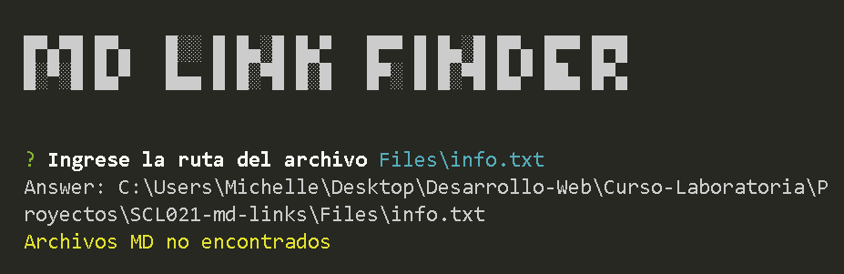
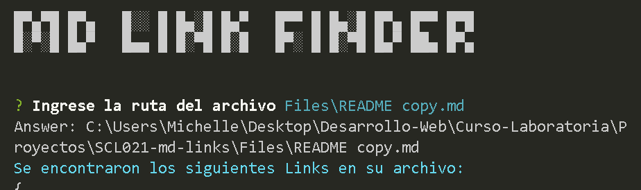
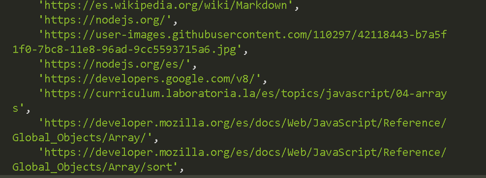
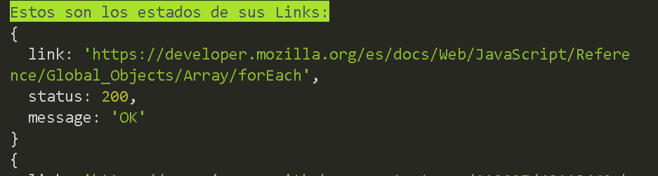
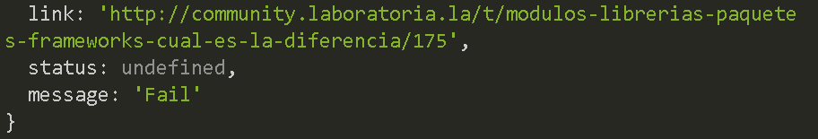
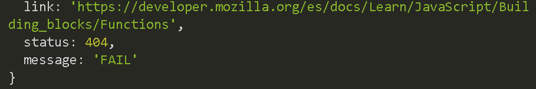

# MD Link Finder

## De Michelle Cifuentes

### Diagrama de Flujo

### Como instalar la libreria MD lInk Finder

Aqui tengo que poner como...

### Resumen del proyecto

En este proyecto es una libreria pensada para programadores, en el que puedan comprobar si un archivo de tipo MD tiene links y cual es el estado de esos Links (si estan funcionando o no).

### Explicación de la Libreria

En primera instancia se le pide al usuario que ingrese la ruta del archivo a leer.

Si el usuario no ingresa un archivo se le indieca que debe ingresar una ruta válida

Si el usuario ingreso una ruta existente pero que no es de tipo MD la consola mostrará que no existen archivos MD.
En todos los casos que existan archivos transformará las rutas a absolutas.

Si el usuario ingreso una ruta existente de tipo MD, el programa la leera y mostrara los Links encontrados:

Luego de mostrar los links encontrados mostrara sus estados.En caso de estar funcionando será el status 200.

Y en caso de no reconocer el Link muestra Undefined y el mensaje será Fail

En caso de no estar funcionando el Link el error que mostrará el status será 404 y el mensaje será FAIL.

